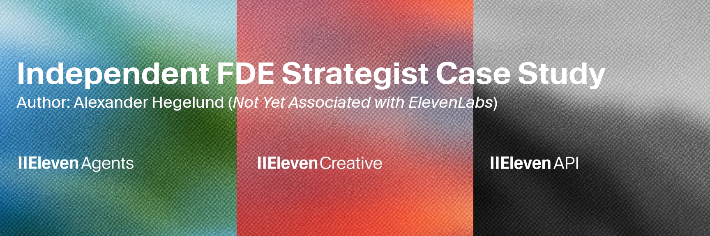

  
   
  
  
  
  
  
  
  

---
# ElevenLabs Forward Deployed Engineer (Strategist): Discovery Sprint
---

> [!WARNING]  
> **WORK IN PROGRESS (WIP)**  
> This repository is an active, real-time Discovery Sprint demonstration. I am currently deep in **Stage 4 (Pilot Execution)**, actively pushing live Python code to prototype a secure telecom deflection agent. You can evaluate my technical execution exactly as it develops. 

> [!NOTE]  
> **The Global Glossary**  
> Enterprise telecom deployments contain severe technical jargon. Note that **every page has a 'Local Glossary' section at the bottom** defining the exact terms used on that specific page. This is a curated subset of the master **[Global DACH Voice AI Glossary](docs/GLOSSARY.md)**, ensuring you never hit a semantic dead-end.

## 🎤 TL;DR: The Discovery Pitch (IDEA Framework)
**The Enterprise is the Hero; The FDE is the Guide.** 
You don't need another candidate to tell you ElevenLabs sounds amazing. You need a Guide who can unblock a stalled €500k ACV enterprise pilot because InfoSec blocked the data pipeline. 

This repository proves I operate at that level of technical integration gravity. I don't write generic demos; I write deployment architectures.
1. **Identify (The 10-Idea Backlog):** I ranked 10 EU vectors and chose **DACH Telecom CX Deflection**. The stakes are well-documented: legacy IVR systems contain only 20–40% of mixed-intent inbound calls — meaning 60–80% still route to an expensive live agent, not because customers prefer it, but because the system cannot understand them.¹ Every uncontained call costs an estimated €6–12 in live-agent handling time.² At a Tier-1 DACH operator scale, the deflectable OPEX opportunity is estimated at **€15–30M annually**.³ If we win this brutal legacy SIP/GDPR environment, we win Europe. If we don't, we cede the DACH enterprise market to the next vendor willing to survive InfoSec Day 1.
2. **Disrupt (The Curse of Multidialectality):** Most competitors assume "German" solves DACH. It fails. I mapped a Zero-Shot translation pipeline for Swiss-German, Austrian, and Bavarian explicitly into the latency bounds. That is where AI-native containment rates of 70–90% for targeted telecom queries become achievable — and where the €15-30M opportunity is captured.⁴
3. **Explain (Prototype Scope vs Bet Map Scope):** *The Prototype Scope* is strictly technical (protecting the <200ms TTFA and Zero-Retention thresholds). *The Bet Map Scope* is wholly commercial—it validates the **[North Star B2B Interlock](03-solution-architecture/03_NORTH_STAR_METRICS.md)**, mathematically linking DACH Telecom's €12.5M OPEX savings directly to ElevenLabs' NRR API usage expansion.
4. **Act (The Invitation):** If you evaluate one thing from this repository, read the [Prototype Scenario](04-flagship-scenario/01_PROTOTYPE_IMPLEMENTATION_PLAN.md). Every architectural decision is traceable to a specific, pre-mortemed risk. That is how I work.

---

## 🧭 Follow Your Evaluation Path
Hiring panels require different proof. Follow the path that maps to your evaluation vectors:

### 1. The FDE Lead / Engineering Panel
You evaluate technical fluency and integration realism.
*   **Start Here**: [`03-solution-architecture`](03-solution-architecture/)
*   **What I Prove**: I design the boundaries where ElevenLabs endpoints safely hit legacy NATs/Firewalls without introducing data degradation or pipeline failures.

### 2. The Sales Director / Go-To-Market Leader
You evaluate my ability to unblock and scale high-ACV Enterprise deals.
*   **Start Here**: [`03-solution-architecture/03_NORTH_STAR_METRICS.md`](03-solution-architecture/03_NORTH_STAR_METRICS.md)
*   **What I Prove**: I translate bare-metal latency restraints directly into an explicit **B2B SaaS Interlock**, mathematically mapping the Client's margin expansion (OPEX) to our usage revenue (NRR).

### 3. Culture & Hiring Managers
You evaluate behavioral fit and authentic scale experience.
*   **Start Here**: [`06-reflection-and-fit/01_APPLICATION_Q-A.md`](06-reflection-and-fit/01_APPLICATION_Q-A.md) and [`06-reflection-and-fit/02_FDE_SKILL_MAPPING.md`](06-reflection-and-fit/02_FDE_SKILL_MAPPING.md)
*   **What I Prove**: I map my multi-year architectural scaling at KAYAK and my NGO crisis logistics directly to ElevenLabs' execution hurdles.

---

> [!IMPORTANT]
> **The STAR Moment — The 150ms Heartbeat Test**
> The single most brutal question in any enterprise Voice AI pilot is: *"What happens when it breaks?"* We don't answer that with a SLA document. We answer it by deliberately crashing the WebRTC socket in a live test and proving deterministic recovery back to the legacy IVR in under 150 milliseconds — without dropping the call. That is the demo that closes enterprise contracts.

## 📅 Execution Velocity: The First 90 Days (Bet Map)
When hired, I map this exact Discovery Sprint methodology to a continuous outcome roadmap using conditional gates. My goal isn't just deployment—it's establishing durable integration operations and **eval automation using agentic telemetry**.

### Bet 1: Standardizing the Transatlantic Penalty (Days 1–30)
*   **Hypothesis**: By indexing friction points in DACH Tier-1 accounts (e.g. NAT traversal, Schrems II), we reduce the pilot setup from weeks to days.
*   **Execution**: Shadow FDEs to validate regulatory blockers. Audit WebRTC-to-SIP translation architectures.
*   **Gate**: **IF** DACH InfoSec clears the zero-retention model, **THEN** proceed to pilot engineering. **ELSE**, establish proxy encryption layers.

### Bet 2: Latency Hardening & Architecture Lock (Days 31–60)
*   **Hypothesis**: Achieving <200ms TTFA on legacy SIP trunks unlocks the critical ACV threshold for European deployments.
*   **Execution**: Build custom Python wrappers around the conversational SDK enforcing the latency budget. 
*   **Logging & Monitoring Constraint**: Implement rigorous DORA telemetry to track model completion latencies, packet loss, and connection failures via continuous dashboards.
*   **Gate**: **IF** latency budget stays consistently <200ms on production-grade loads, **THEN** launch flagship pilot. **ELSE**, deploy voice activity detection (VAD) buffer optimizations.

### Bet 3: Flagship Pilot & Telemetry Operations (Days 61–90)
*   **Hypothesis**: A live deployment with integrated Telemetry and Voice Analytics proves "Proof over Promise" for Enterprise retention.
*   **Execution**: Go-Live on a Tier-1 IT Service Deflection account. Enable EU AI Act compliant, zero-pii dashboards. Embed deep **Logging and Monitoring** of human-barge-ins and tool execution confidence intervals.
*   **Gate**: **IF** Tier-1 Pilot effectively answers >60% intent-driven loops successfully, **THEN** package workflow into standardized European Field Playbook. **ELSE**, iteratively fine-tune prompt topology and latency buffers.

> [!TIP]
> **See This In Action:** The baseline CI/CD evaluation framework is already built and live. I executed `03_braintrust_eval_pipeline.py` to capture a **90% FCR Pass Rate** across 10 high-friction Swiss/Austrian interactions. The raw telemetry trace is anchored at [`eval_results.json`](04-flagship-scenario/eval_results.json).

---

## 📂 Repository Structure
*   [`01-opportunity-framing`](01-opportunity-framing/): Business Value Drivers & Role Thesis.
*   [`02-customers-and-use-cases`](02-customers-and-use-cases/): Market scan, research synthesis, and portfolio selection.
*   [`03-solution-architecture`](03-solution-architecture/): Technical specs for **SIP Hardening**, **Latency**, and **Evaluation Frameworks**.
*   [`04-flagship-scenario`](04-flagship-scenario/): Implementation plan for the **Hardened Hero** pilot case.
*   [`06-reflection-and-fit`](06-reflection-and-fit/): Application Q&A and exact FDE Skill Mapping.

---

**Footnotes**
¹ IVR self-service containment benchmark (20–40% for mixed-intent environments): Umbrex / Prodigal Research, 2024.
² Cost-per-live-agent-call (€6–12): Global industry benchmark; DACH figures may vary by operator scale and labour market. Source: industry composite (IBM, Intermedia, Prodigal), 2024.
³ OPEX derivation: A representative DACH Tier-1 operator handling 5–10M annual inbound contacts at €6–12/uncontained call, with a 20–40pp containment shift, yields an estimated €15–30M annual deflection opportunity. '€20M' represents the conservative midpoint.
⁴ AI voice agent containment (70–90% for targeted telecom queries): Industry composite citing resolution-first AI operating models. Source: contactcentremonthly.co.uk, prodigaltech.com, 2024. Gartner projects agentic AI to autonomously resolve the majority of routine customer service interactions by 2029.

---

## 📚 Local Glossary:

_Consult the [Global Glossary](docs/GLOSSARY.md) for the full list of terms used in this repo._

- **ACV (Annual Contract Value)** (The annualized revenue metric of a customer contract.)
- **FDE (Forward Deployed Engineer)** (A hybrid engineering and strategy role focused on deploying complex enterprise integrations.)
